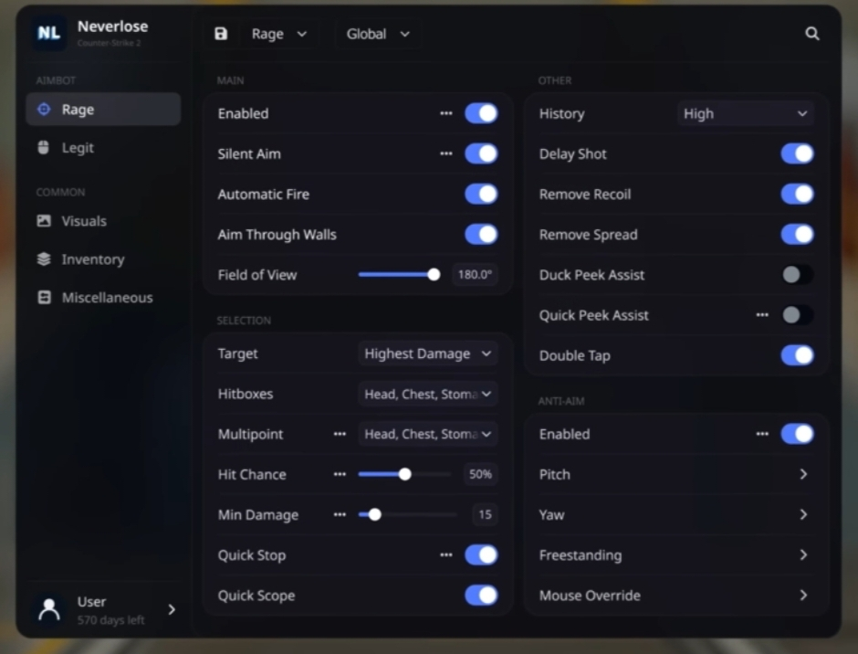

# NEVERLOSE UI LIBRARY

# Developers:
1. CludeHub
2. LunarCore Devs (Device21)

# Pictures


# Source
```lua
local Library = loadstring(game:HttpGet("https://raw.githubusercontent.com/CludeHub/Can-You-Come-Back-To-Me/refs/heads/main/NEVERLOSE-CS2-SOURCE.lua"))()
```

# TABLE OF CONTENTS

- Setup  
- Window  
- Tabs and Sub-Tabs  
- Sections  
- Elements  
- Toggle  
- Slider  
- Dropdown  
- Colorpicker  
- Toggle and Colorpicker  
- Dropdown and Colorpicker  
- Accordion  
- Settings Panel (per-element)  
- Settings: Toggle  
- Settings: Checkbox  
- Settings: Slider  
- Settings: Dropdown  
- Settings: Colorpicker  
- Accordion Elements  
- Config System  
- Available Icons  

---

# SETUP

Wrap the library and call `Library:AddWindow(...)` to get started:

```lua
local Window = Library:AddWindow(hubTitle, hubImage, gameTitle)
```

Parameters:  
- hubTitle – Title shown in the header  
- hubImage – rbxassetid for the header logo  
- gameTitle – Game name shown in the header  

Toggle the UI: Press H or click the floating Close [H] button  

---

# WINDOW

```lua
local Window = Library:AddWindow("Neverlose", "rbxassetid://...", "Counter Strike 2")
```

Includes:  
- Acrylic blur background  
- FPS and ping overlay  
- User avatar and username display  
- Settings panel (color picker, UI scale, language)  
- Config save/load system  
- Search bar  

---

# TABS AND SUB-TABS

```lua
local MyTab = Window:AddTab(name, icon)
Window:AddTabLabel("Common")
local SubTab = MyTab:AddSubTab(name, icon)
```

Example:

```lua
local LegitTab = Window:AddTab("Legit", "crosshair")

Window:AddTabLabel("Common")

local VisualsTab = Window:AddTab("Visuals", "image")
local PlayersSubTab = VisualsTab:AddSubTab("Players", "user")
local WorldSubTab = VisualsTab:AddSubTab("World", "earth")
```

---

# SECTIONS

```lua
local Section = Tab:AddSection(title, side)
```

side = "left" or "right"

Example:

```lua
local AimbotSection = LegitTab:AddSection("AIMBOT", "left")
local TriggerSection = LegitTab:AddSection("TRIGGERBOT", "right")
```

---

# ELEMENTS

All elements are added to a Section.

---

# TOGGLE

```lua
local toggle = Section:AddToggle(text, default, callback)
```

Methods:
- toggle:Set(value)
- toggle:Get()
- toggle:AddSettings()

Example:

```lua
local bhop = Section:AddToggle("Bunny Hop", false, function(v)
    print(v)
end)
```

---

# SLIDER

```lua
local slider = Section:AddSlider(text, min, max, default, callback, suffix)
```

Example:

```lua
local fov = Section:AddSlider("FOV", 0, 180, 90, function(v)
    print(v)
end, "°")
```

---

# DROPDOWN

```lua
local dropdown = Section:AddDropdown(text, options, default, callback)
```

Example:

```lua
local hitbox = Section:AddDropdown("Hitbox", {"Head", "Chest", "Legs"}, "Head", function(v)
    print(v)
end)
```

---

# COLORPICKER

```lua
local picker = Section:AddColorpicker(text, defaultColor, callback)
```

Example:

```lua
local color = Section:AddColorpicker("Chams Color", Color3.fromRGB(255,100,100), function(c)
    print(c)
end)
```

---

# TOGGLE + COLORPICKER

```lua
Section:AddToggleColorpicker(text, defaultEnabled, defaultColor, callback, colorCallback)
```

Example:

```lua
Section:AddToggleColorpicker("Bullet Impacts", false, Color3.fromRGB(255,100,100),
    function(v) print(v) end,
    function(c) print(c) end
)
```

---

# DROPDOWN + COLORPICKER

```lua
Section:AddDropdownColorpicker(text, options, defaultColor, callback, colorCallback)
```

Example:

```lua
Section:AddDropdownColorpicker("Log Events", {"All", "Hits", "Deaths"}, Color3.fromRGB(255,255,255),
    function(v) print(v) end
)
```

---

# ACCORDION

```lua
local acc = Section:AddAccordion(text)
```

Example:

```lua
local accScope = ViewSection:AddAccordion("Scope Options")
accScope:AddToggle("Remove Scope", false, function(v) print(v) end)
accScope:AddSlider("Zoom Level", 1, 10, 5, function(v) print(v) end)
```

---

# SETTINGS PANEL

```lua
local settings = toggle:AddSettings()
```

Supports:
- Toggle  
- Checkbox  
- Slider  
- Dropdown  
- Colorpicker  

Example:

```lua
local grenadeTrajectory = Section:AddToggle("Grenade Trajectory", false, function(v)
    print(v)
end)

local s = grenadeTrajectory:AddSettings()
s:AddCheckbox("Only Teammates", false, function(v) print(v) end)
s:AddSlider("Thickness", 1, 5, 2, function(v) print(v) end)
```

---

# ACCORDION ELEMENTS

```lua
acc:AddToggle("Option", false, function(v) end)
acc:AddSlider("Value", 1, 10, 5, function(v) end)
acc:AddDropdown("Mode", {"A", "B"}, "A", function(v) end)
```

---

# CONFIG SYSTEM

Features:
- Create named configs  
- Save and load configs  
- Duplicate configs  
- Delete configs  
- Search configs  
- Auto-save every 30 seconds  

Supported types:
- boolean  
- number  
- string  
- Color3  

---

# AVAILABLE ICONS

ads  
list  
folder  
earth  
locked  
home  
mouse  
user  
cosmetics  
sun  
shop  
farm  
code  
crosshair  
image  
layers  
side  
grenade  
bio  
camera  
car  
run  
box  
carcolor  
avacolor  
locker  
retry  
gun  
sword  
knife  
egg  
sprinkler  
gear  

---

# FULL EXAMPLE

```lua

local Library = loadstring(game:HttpGet("https://raw.githubusercontent.com/CludeHub/Can-You-Come-Back-To-Me/refs/heads/main/NEVERLOSE-CS2-SOURCE.lua"))()

local Window = Library:AddWindow("Neverlose", "rbxassetid://118608145176297", "Counter Strike 2")

Window:AddTabLabel("Aimbot")
local RageTab = Window:AddTab("Rage", "crosshair")

local MainSection = RageTab:AddSection("MAIN", "left")

local toggleEnabled = MainSection:AddToggle("Enabled", true, function(v)
	print("Enabled:", v)
end)

local grr = toggleEnabled:AddSettings()
grr:AddToggle("Force Shoot", false, function(val)
end)

local toggleSilentAim = MainSection:AddToggle("Silent Aim", true, function(v)
	print("Silent Aim:", v)
end)
local silentAimSettings = toggleSilentAim:AddSettings()
silentAimSettings:AddToggle("Perfect Silent Aim", false, function(val)
end)

MainSection:AddToggle("Automatic Fire", true, function(v)
	print("Automatic Fire:", v)
end)
MainSection:AddToggle("Aim Through Walls", true, function(v)
	print("Aim Through Walls:", v)
end)

MainSection:AddSlider("Field of View", 1, 180, 180, function(v)
	print("FOV:", v)
end, "°")

local SelectionSection = RageTab:AddSection("SELECTION", "left")

SelectionSection:AddDropdown("Target", {"Highest Damage", "Closest", "Random"}, function(v)
	print("Target:", v)
end)

SelectionSection:AddDropdown("Hitboxes", {"Head, Chest, Stomach", "Arms, Legs, Extremities"}, function(v)
	print("Hitboxes:", v)
end)

local dropMultipoint = SelectionSection:AddDropdown("Multipoint", {"Head, Chest, Stomach", "Arms, Legs, Extremities"}, function(v)
	print("Multipoint:", v)
end)
local brr = dropMultipoint:AddSettings()
brr:AddSlider("Multipoint", 0,100,79, function(val)
end)

local sliderHitChance = SelectionSection:AddSlider("Hit Chance", 0, 100, 60, function(v)
	print("Hit Chance:", v)
end, "%")
sliderHitChance:AddSettings()

local sliderMinDamage = SelectionSection:AddSlider("Min Damage", 0, 100, 15, function(v)
	print("Min Damage:", v)
end)
sliderMinDamage:AddSettings()

local toggleQuickStop = SelectionSection:AddToggle("Quick Stop", true, function(v)
	print("Quick Stop:", v)
end)


local patapim = toggleQuickStop:AddSettings()
patapim:AddDropdown("Auto Stop", { "Early","In air","Between Shot","Force Accurate"}, function(val)
end)


patapim:AddDropdown("Auto Stop", { "Early","In air","Between Shot","Force Accurate"}, function(val)
end)

patapim:AddDropdown("Auto Stop", { "Early","In air","Between Shot","Force Accurate"}, function(val)
end)

patapim:AddDropdown("Auto Stop", { "Early","In air","Between Shot","Force Accurate"}, function(val)
end)

patapim:AddDropdown("Auto Stop", { "Early","In air","Between Shot","Force Accurate"}, function(val)
end)

patapim:AddDropdown("Auto Stop", { "Early","In air","Between Shot","Force Accurate"}, function(val)
end)

patapim:AddDropdown("Auto Stop", { "Early","In air","Between Shot","Force Accurate"}, function(val)
end)

patapim:AddDropdown("Auto Stop", { "Early","In air","Between Shot","Force Accurate"}, function(val)
end)

patapim:AddDropdown("Auto Stop", { "Early","In air","Between Shot","Force Accurate"}, function(val)
end)

patapim:AddDropdown("Auto Stop", { "Early","In air","Between Shot","Force Accurate"}, function(val)
end)

patapim:AddDropdown("Auto Stop", { "Early","In air","Between Shot","Force Accurate"}, function(val)
end)

patapim:AddDropdown("Auto Stop", { "Early","In air","Between Shot","Force Accurate"}, function(val)
end)

patapim:AddDropdown("Auto Stop", { "Early","In air","Between Shot","Force Accurate"}, function(val)
end)

patapim:AddDropdown("Auto Stop", { "Early","In air","Between Shot","Force Accurate"}, function(val)
end)

patapim:AddDropdown("Auto Stop", { "Early","In air","Between Shot","Force Accurate"}, function(val)
end)

patapim:AddDropdown("Auto Stop", { "Early","In air","Between Shot","Force Accurate"}, function(val)
end)

patapim:AddDropdown("Auto Stop", { "Early","In air","Between Shot","Force Accurate"}, function(val)
end)

patapim:AddDropdown("Auto Stop", { "Early","In air","Between Shot","Force Accurate"}, function(val)
end)

patapim:AddDropdown("Auto Stop", { "Early","In air","Between Shot","Force Accurate"}, function(val)
end)

patapim:AddDropdown("Auto Stop", { "Early","In air","Between Shot","Force Accurate"}, function(val)
end)


SelectionSection:AddToggle("Quick Scope", true, function(v)
	print("Quick Scope:", v)
end)

local OtherSection = RageTab:AddSection("OTHER", "right")

OtherSection:AddDropdown("History", {"Off", "Medium", "High", "Maximum"}, function(v)
	print("History:", v)
end)

OtherSection:AddToggle("Delay Shot", true, function(v)
	print("Delay Shot:", v)
end)

OtherSection:AddToggle("Remove Recoil", true, function(v)
	print("Remove Recoil:", v)
end)

OtherSection:AddToggle("Remove Spread", true, function(v)
	print("Remove Spread:", v)
end)

OtherSection:AddToggle("Duck Peek Assist", false, function(v)
	print("Duck Peek Assist:", v)
end)

local toggleQuickPeek = OtherSection:AddToggle("Quick Peek Assist", false, function(v)
	print("Quick Peek Assist:", v)
end)
toggleQuickPeek:AddSettings()

OtherSection:AddToggle("Double Tap", false, function(v)
	print("Double Tap:", v)
end)

local AntiAimSection = RageTab:AddSection("ANTI-AIM", "right")

local toggleAntiAim = AntiAimSection:AddToggle("Enabled", true, function(v)
	print("Anti-Aim Enabled:", v)
end)
toggleAntiAim:AddSettings()

local accPitch = AntiAimSection:AddAccordion("Pitch")
accPitch:AddDropdown("Direction", {"Down", "Up", "Zero", "Random"}, function(v)
	print("Pitch:", v)
end)

local accYaw = AntiAimSection:AddAccordion("Yaw")
accYaw:AddDropdown("Direction", {"Backwards", "Forwards", "Sideways", "Random"}, function(v)
	print("Yaw:", v)
end)

local accFreestanding = AntiAimSection:AddAccordion("Freestanding")
accFreestanding:AddToggle("Enabled", false, function(v)
	print("Freestanding:", v)
end)

local accMouseOverride = AntiAimSection:AddAccordion("Mouse Override")
accMouseOverride:AddToggle("Enabled", false, function(v)
	print("Mouse Override:", v)
end)

local LegitTab = Window:AddTab("Legit", "mouse")

-- MAIN Section (left)
local LegitMainSection = LegitTab:AddSection("MAIN", "left")

LegitMainSection:AddToggle("Enabled", true, function(v)
	print("Legit Enabled:", v)
end)

-- AIMBOT Section (left)
local LegitAimbotSection = LegitTab:AddSection("AIMBOT", "left")

LegitAimbotSection:AddToggle("Enabled", true, function(v)
	print("Legit Aimbot Enabled:", v)
end)

LegitAimbotSection:AddDropdown("Activation", {"Assisted", "Rage", "Manual"}, function(v)
	print("Activation:", v)
end)

local legitConditions = LegitAimbotSection:AddDropdown("Conditions", {"Through Smokes", "Visible Only", "Always"}, function(v)
	print("Legit Conditions:", v)
end)
legitConditions:AddSettings()

LegitAimbotSection:AddDropdown("Hitboxes", {"Head", "Chest", "Stomach", "Arms", "Legs"}, function(v)
	print("Legit Hitboxes:", v)
end)

LegitAimbotSection:AddSlider("Field of View", 1, 180, 20, function(v)
	print("Legit FOV:", v)
end, "u")

local legitSmoothing = LegitAimbotSection:AddSlider("Smoothing", 0, 100, 50, function(v)
	print("Smoothing:", v)
end, "%")

LegitAimbotSection:AddSlider("Reaction Time", 0, 1000, 200, function(v)
	print("Legit Reaction Time:", v)
end, "ms")

LegitAimbotSection:AddSlider("Target Switch Delay", 0, 1000, 200, function(v)
	print("Target Switch Delay:", v)
end, "ms")

LegitAimbotSection:AddToggle("First Bullet Delay", false, function(v)
	print("First Bullet Delay:", v)
end)

local legitRecoil = LegitAimbotSection:AddToggle("Recoil Control", false, function(v)
	print("Recoil Control:", v)
end)
legitRecoil:AddSettings()

local legitQuickScope = LegitAimbotSection:AddToggle("Quick Scope", false, function(v)
	print("Quick Scope:", v)
end)
legitQuickScope:AddSettings()

-- TRIGGERBOT Section (right)
local LegitTriggerbotSection = LegitTab:AddSection("TRIGGERBOT", "right")

LegitTriggerbotSection:AddToggle("Enabled", false, function(v)
	print("Triggerbot Enabled:", v)
end)

local tbConditions = LegitTriggerbotSection:AddDropdown("Conditions", {"Through Smokes", "Visible Only", "Always"}, function(v)
	print("Triggerbot Conditions:", v)
end)
tbConditions:AddSettings()

LegitTriggerbotSection:AddDropdown("Hitboxes", {"Head, Chest, Stomach", "Arms, Legs, Extremities"}, function(v)
	print("Triggerbot Hitboxes:", v)
end)

local tbHitChance = LegitTriggerbotSection:AddSlider("Hit Chance", 0, 100, 50, function(v)
	print("Hit Chance:", v)
end, "%")
tbHitChance:AddSettings()

local tbMinDamage = LegitTriggerbotSection:AddSlider("Min Damage", 0, 100, 0, function(v)
	print("Min Damage:", v)
end)
tbMinDamage:AddSettings()

LegitTriggerbotSection:AddSlider("Reaction Time", 0, 1000, 0, function(v)
	print("Triggerbot Reaction Time:", v)
end, "ms")

LegitTriggerbotSection:AddSlider("Burst Time", 0, 500, 50, function(v)
	print("Burst Time:", v)
end, "ms")

local tbQuickScope = LegitTriggerbotSection:AddToggle("Quick Scope", false, function(v)
	print("Triggerbot Quick Scope:", v)
end)
tbQuickScope:AddSettings()

-- OTHER Section (right)
local LegitOtherSection = LegitTab:AddSection("OTHER", "right")

local tbVisualize = LegitOtherSection:AddToggle("Visualize", false, function(v)
	print("Visualize:", v)
end)
tbVisualize:AddSettings()

local tbAutoPistols = LegitOtherSection:AddToggle("Automatic Pistols", false, function(v)
	print("Automatic Pistols:", v)
end)
tbAutoPistols:AddSettings()

local tbStandaloneRecoil = LegitOtherSection:AddToggle("Standalone Recoil Control", false, function(v)
	print("Standalone Recoil Control:", v)
end)
tbStandaloneRecoil:AddSettings()

LegitOtherSection:AddDropdown("Randomize", {"Low", "Medium", "High", "Off"}, function(v)
	print("Randomize:", v)
end)

Window:AddTabLabel("Common")
local VisualsTab = Window:AddTab("Visuals", "image")

-- Sub-tabs: Players, World (active in image), Inventory
local PlayersSubTab = VisualsTab:AddSubTab("Players", "user")
local WorldSubTab   = VisualsTab:AddSubTab("World", "earth")
local InventorySubTab = Window:AddTab("Inventory", "layers")

-- Players sub-tab sections
local PlayersSection = PlayersSubTab:AddSection("PLAYERS", "left")
PlayersSection:AddToggle("ESP Enabled", false, function(v) print("Players ESP:", v) end)
PlayersSection:AddToggle("Skeletons", false, function(v) print("Skeletons:", v) end)
PlayersSection:AddDropdown("Box Type", {"Off", "2D", "2D Corner", "3D"}, function(v) print("Box Type:", v) end)

local PlayersRightSection = PlayersSubTab:AddSection("INFO", "right")
PlayersRightSection:AddToggle("Health Bar", false, function(v) print("Health Bar:", v) end)
PlayersRightSection:AddToggle("Name Tag", false, function(v) print("Name Tag:", v) end)
PlayersRightSection:AddToggle("Distance", false, function(v) print("Distance:", v) end)

-- World sub-tab sections (VIEW left, WORLD ESP left, HUD right, MISC right — matching image)
local ViewSection = WorldSubTab:AddSection("VIEW", "left")

local accViewOptions = ViewSection:AddAccordion("View Options")
local accScopeOptions = ViewSection:AddAccordion("Scope Options")
local accViewmodelOptions = ViewSection:AddAccordion("Viewmodel Options")
local accPerspectiveOptions = ViewSection:AddAccordion("Perspective Options")

ViewSection:AddDropdown("Unlock Spectating", {"Select", "All", "Teammates", "Enemies"}, function(v)
	print("Unlock Spectating:", v)
end)

ViewSection:AddDropdown("Visual Recoil", {"Select", "Off", "Enabled"}, function(v)
	print("Visual Recoil:", v)
end)

local WorldEspSection = WorldSubTab:AddSection("WORLD ESP", "left")

local accBomb = WorldEspSection:AddAccordion("Bomb")
local accWeapons = WorldEspSection:AddAccordion("Weapons")
local accHostages = WorldEspSection:AddAccordion("Hostages")
local accGrenades = WorldEspSection:AddAccordion("Grenades")

local grenadeTrajectory = WorldEspSection:AddToggle("Grenade Trajectory", false, function(v)
	print("Grenade Trajectory:", v)
end)
grenadeTrajectory:AddSettings()

WorldEspSection:AddToggle("Grenade Proximity Warnings", false, function(v)
	print("Grenade Proximity Warnings:", v)
end)

local HudSection = WorldSubTab:AddSection("HUD", "right")

HudSection:AddToggle("Radar", false, function(v) print("Radar:", v) end)
HudSection:AddToggle("Preserve Killfeed", false, function(v) print("Preserve Killfeed:", v) end)
HudSection:AddToggleColorpicker("Inaccuracy Overlay", false, Color3.fromRGB(255, 255, 255), function(v)
	print("Inaccuracy Overlay:", v)
end, function(c) print("Inaccuracy Overlay Color:", c) end)
HudSection:AddDropdown("Scope Overlay", {"Default", "Off", "Custom"}, function(v) end)
local accScoreboard = HudSection:AddAccordion("Scoreboard")
local accCrosshairs = HudSection:AddAccordion("Crosshairs")

local MiscVisSection = WorldSubTab:AddSection("MISCELLANEOUS", "right")
local accWindows = MiscVisSection:AddAccordion("Windows")
local accRemovals = MiscVisSection:AddAccordion("Removals")
local accAmbience = MiscVisSection:AddAccordion("Ambience")
local accHitMarker = MiscVisSection:AddAccordion("Hit Marker")
local accBulletTracers = MiscVisSection:AddAccordion("Bullet Tracers")
MiscVisSection:AddToggleColorpicker("Bullet Impacts", false, Color3.fromRGB(255, 100, 100), function(v)
	print("Bullet Impacts:", v)
end, function(c) print("Bullet Impacts Color:", c) end)

-- Inventory sub-tab
local InventorySection = InventorySubTab:AddSection("SKINS", "left")
InventorySection:AddToggle("Skin Changer", false, function(v) print("Skin Changer:", v) end)
InventorySection:AddToggle("Knife Changer", false, function(v) print("Knife Changer:", v) end)
InventorySection:AddToggle("Glove Changer", false, function(v) print("Glove Changer:", v) end)
local MiscTab = Window:AddTab("Miscellaneous", "gear")

local MovementSection = MiscTab:AddSection("MOVEMENT", "left")

MovementSection:AddToggle("Bunny Hop", false, function(v)
	print("Bunny Hop:", v)
end)

local airStrafe = MovementSection:AddToggle("Air Strafe", false, function(v)
	print("Air Strafe:", v)
end)
airStrafe:AddSettings()

local jumpBug = MovementSection:AddToggle("Jump Bug", false, function(v)
	print("Jump Bug:", v)
end)
jumpBug:AddSettings()

MovementSection:AddToggle("No Fall Damage", false, function(v)
	print("No Fall Damage:", v)
end)

MovementSection:AddToggle("Standalone Quick Stop", false, function(v)
	print("Standalone Quick Stop:", v)
end)

MovementSection:AddToggle("Strafe Assist", false, function(v)
	print("Strafe Assist:", v)
end)

MovementSection:AddToggle("Edge Jump", false, function(v)
	print("Edge Jump:", v)
end)

local slowWalk = MovementSection:AddToggle("Slow Walk", false, function(v)
	print("Slow Walk:", v)
end)
slowWalk:AddSettings()

MovementSection:AddToggle("Fast Ladder", false, function(v)
	print("Fast Ladder:", v)
end)

-- FEATURES Section (right)
local FeaturesSection = MiscTab:AddSection("FEATURES", "right")

FeaturesSection:AddToggle("Quick Switch", false, function(v)
	print("Quick Switch:", v)
end)

FeaturesSection:AddToggle("Super Toss", false, function(v)
	print("Super Toss:", v)
end)

FeaturesSection:AddToggle("Prevent AFK Kick", false, function(v)
	print("Prevent AFK Kick:", v)
end)

FeaturesSection:AddToggle("Unlock Loadout", false, function(v)
	print("Unlock Loadout:", v)
end)

local hitSound = FeaturesSection:AddToggle("Hit Sound", false, function(v)
	print("Hit Sound:", v)
end)
hitSound:AddSettings()

local autoPurchase = FeaturesSection:AddToggle("Automatic Purchase", false, function(v)
	print("Automatic Purchase:", v)
end)
autoPurchase:AddSettings()

local autoGrenadeRelease = FeaturesSection:AddToggle("Automatic Grenade Release", false, function(v)
	print("Automatic Grenade Release:", v)
end)
local autoGrenadeReleaseSettings = autoGrenadeRelease:AddSettings()
autoGrenadeReleaseSettings:AddCheckbox("Some Option", false, function(v)
end)

FeaturesSection:AddToggle("Auto-Accept Matchmaking", false, function(v)
	print("Auto-Accept Matchmaking:", v)
end)


FeaturesSection:AddDropdownColorpicker("Log Events", {"Select", "All", "Hits", "Deaths"}, Color3.fromRGB(255,255,255), function(v)
	print("Log Events:", v)
end)
```
